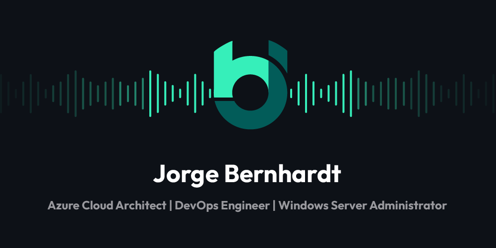

### Hi there! 👋
I'm Jorge Bernhardt, a Cloud Architect working for a software consulting company in Spain 🇪🇸. With a specialization in Microsoft technologies, including cloud and data center solutions, I have a strong focus on working with DevOps and Agile methodologies to drive efficient and effective results 📈
My passion for Infrastructure as Code has led me to work on projects that incorporate these principles, allowing me to stay up-to-date with the latest trends and emerging technologies 🎖 Whether through my work or in my free time, I enjoy sharing my knowledge with others 📢
With a track record of driving quality results for clients, I am excited to continue helping organizations meet their cloud infrastructure needs while adhering to best practices and the latest advancements in technology.
### Technologies & Tools

      

### Microsoft Azure Hero Recognitions

### Latest Blog Posts from [www.jorgebernhardt.com](https://www.jorgebernhardt.com)
<!-- BLOG-POST-LIST:START -->
- [Setting Private Endpoint for Azure File Share using Azure PowerShell](https://www.jorgebernhardt.com/private-endpoint-azure-file-share-powershell/)
- [How to update the tenant ID in an Azure key vault](https://www.jorgebernhardt.com/update-tenant-id-key-vault/)
- [Creating Restore Points for Azure VMs using Azure CLI](https://www.jorgebernhardt.com/vm-restore-points-cli/)
- [Setting Private Endpoint for Azure Key Vault using Azure PowerShell](https://www.jorgebernhardt.com/private-endpoint-azure-key-vault-powershell/)
- [Setting Private Endpoint for Azure SQL Server using Azure PowerShell](https://www.jorgebernhardt.com/private-endpoints-sql-server-powershell/)
<!-- BLOG-POST-LIST:END -->
<!-- Actual text -->

Please follow me on  and  and support my work. Thank you.

